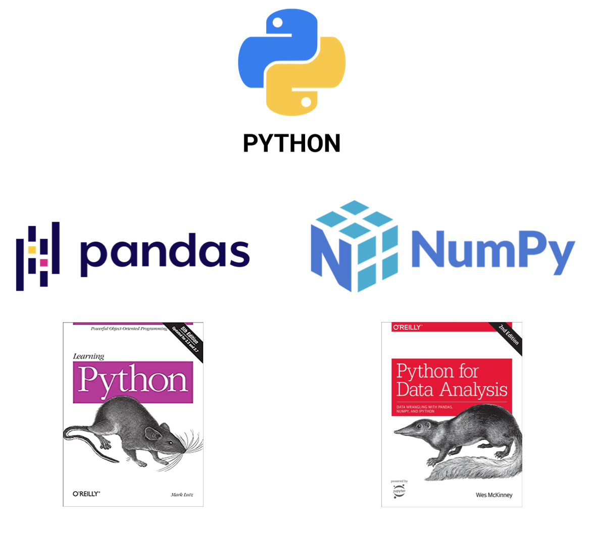

# Introduction to Python 

This repository contains the materials (datasets, code and slides) for the 1-day Introduction to Python course taught at Esade for the Executive Master students in Business Analytics.

# Contents
- [Installation](#Installation)
- [Materials](#Materials)        

# Installation
## Clone repository
If you want to make use of all the materials, cloning the code to your local or downloading it would be the best. In order to do so:

    git clone git@github.com:pepebonet/Class_Python.git

## Install dependencies
We highly recommend to use a virtual environment to work with the code, as additional packages may need to be downloaded as you keep coding. To do so: 

`Create environment:`

    conda create --name python_intro python=3.8
    conda activate python_intro

From there the only packages that are needed are `pandas` and `numpy` for now and that jupyter notebooks can be run. 

# Materials

